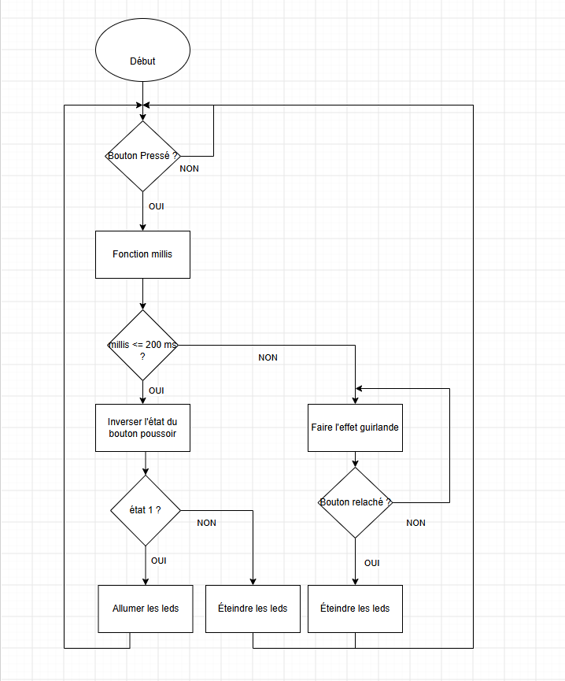
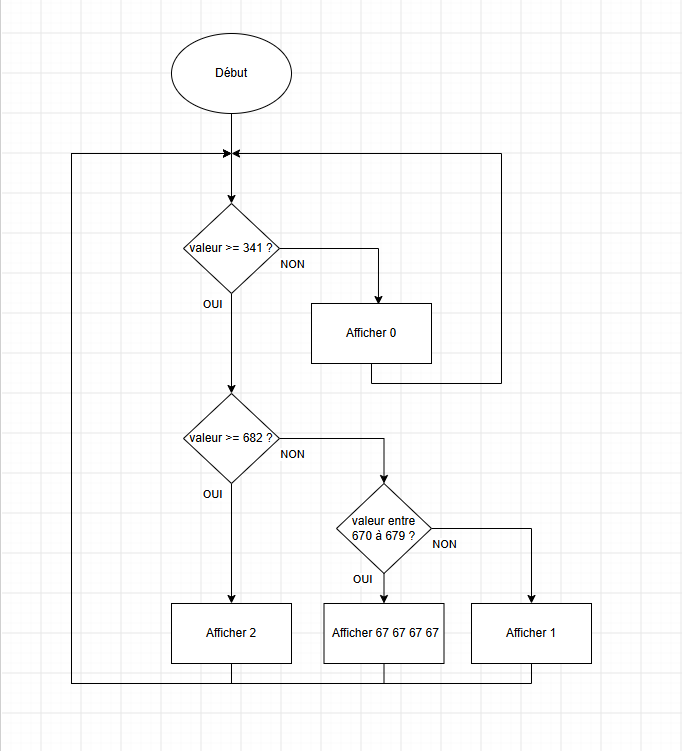

<h1>Mon Projet Tinkercad</h1>

Bienvenue sur mon projet web !

<h2>📁 Contenu du projet</h2>
<ul>
  <li>🏠 Page d'accueil : <a href="index.html">index.html</a></li>
  <li>📄 Seconde page : <a href="page2.html">page2.html</a></li>
  <li>📄 Troisième page : <a href="page3.html">page3.html</a></li>
  <li>🎨 Feuille de style : <a href="styles.css">styles.css</a></li>
</ul>

